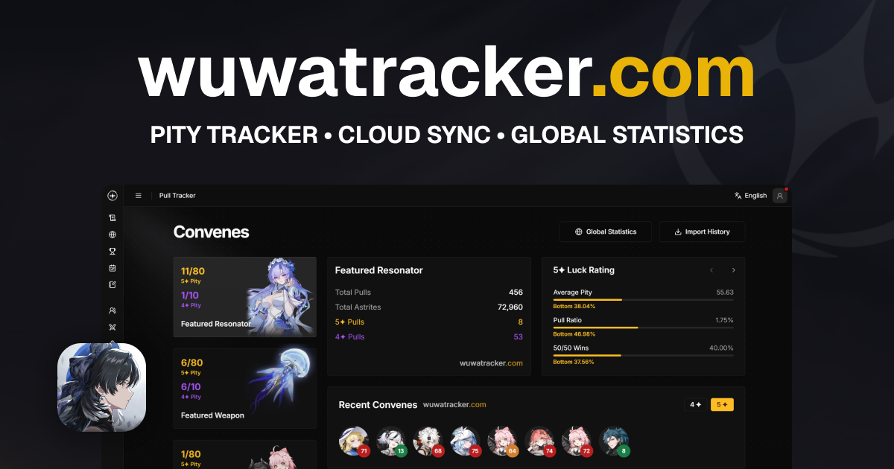

<h1 align="center">
  <a href="https://wuwatracker.com">
    <picture>
      <source media="(prefers-color-scheme: dark)" srcset="./img/logo-white.png">
      <source media="(prefers-color-scheme: light)" srcset="./img/logo-black.png">
      
    </picture>
  </a>
</h1>

  <i>A pity counter for Wuthering Waves, using the up-to-date data with global statistics and more. Share your pulls with your friends and track your account!</i>  
  <i>Built with <a href="https://nextjs.org/">Next.js</a> + <a href="https://www.typescriptlang.org/">TypeScript</a> and deployed  @ <a href="https://wuwatracker.com">wuwatracker.com</a>.</i>

<h5 align="center">
  
  
  
  
   
   
  
  
</h5>

## Contributing

Check our [GitHub Organization](https://github.com/wuwatracker) for our repositories.
